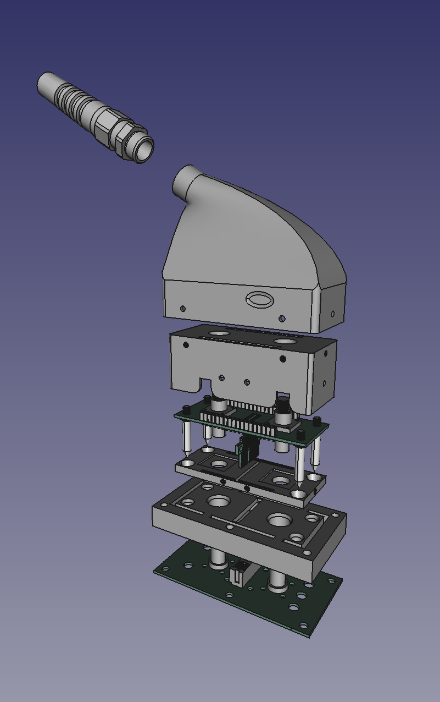
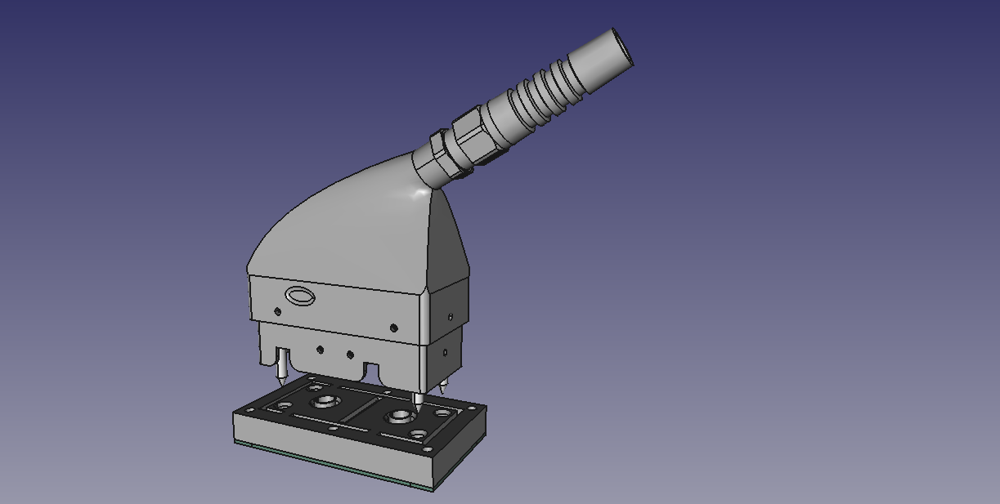

# Transmit/Receive RF Coil Connector
This design is the first of the [OpenConnectors](https://github.com/dezanche/Open_Connectors) collection. It is intended for use with MRI radio frequency coils that operate in transmit/receive mode and supports a maximum of 2 coaxial connections.

## Connector Structure
The connector consists of a system-side and coil-side housing which are designed to mate. Each housing is made of off-the-shelf and 3D-printed parts that enclose and support the printed circuit boards (PCBs) which contain the electrical contacts.

### Connector Housing
System-side and coil-side housing parts are defined in the [FreeCAD file](housings/connector_full_3D_model.FCStd) which contains the full 3D model of the connector. Individual parts can be exported from [FreeCAD](https://www.freecad.org/) to various formats for fabrication. The [bill of materials](housings/TR_RF_coil_connector_full_3D_BOM.md) lists off-the-shelf and other parts required to build the connector.

Each official release will include *stl* files (common file format accepted by 3D printer software) in the [exported](exported/) sub-folder.

### Connector Boards
[KiCAD](https://www.kicad.org/) files of the PCBs will be provided in the [boards](boards/) directory.

## Contributors

Tri Nguyen

Umberto Zanovello

Nicola De Zanche

## CITATION

If you use this connector in your work, please cite it as described in the [CITATION](CITATION.cff) file.

## Licenses
Layouts and other CAD files are licensed under the [CERN-OHL-W 2.0 license](https://cern-ohl.web.cern.ch/), version 2.0 or any later version.\
\
All other original content in this repository (including this README file) is licensed under a [Creative Commons Attribution-NoDerivatives 4.0 International License](https://creativecommons.org/licenses/by-nd/4.0/).
